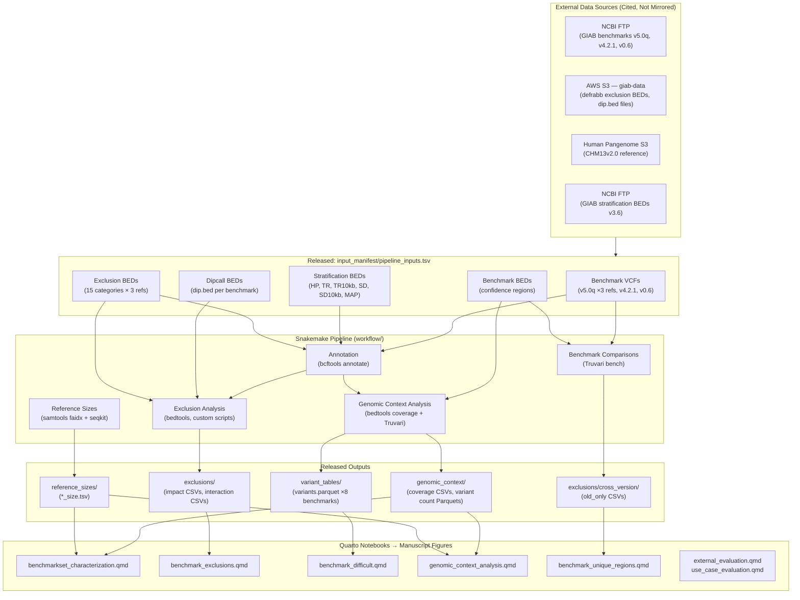
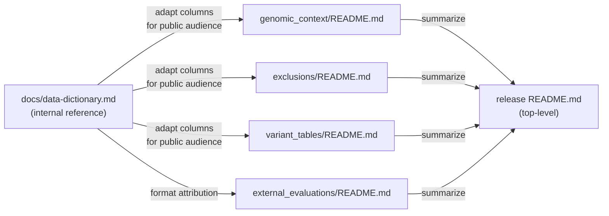
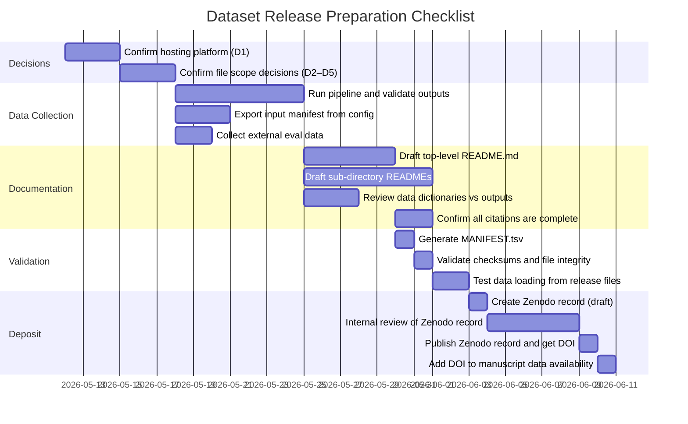

# Public Dataset Release Plan: GIAB Q100 HG002 Variant Benchmark Analysis

**Date:** 2026-05-12  
**Branch:** `claude/plan-dataset-release-docs-mzafA`  
**Purpose:** Plan for organizing and documenting a public data release to accompany the q100 variant benchmark manuscript. The released dataset will be cited in the Data Availability section.

---

## 1. Executive Summary

This plan covers the creation of a citable, publicly archived dataset that includes:

1. **Pipeline input data** — the exact set of external files consumed by the Snakemake pipeline (benchmark VCFs and BEDs, exclusion regions, dipcall assembly regions, stratification BEDs, reference genome size tables). Most of these are already hosted on NCBI/GIAB servers; the release provides a versioned manifest with checksums to ensure exact reproducibility.
2. **Pipeline output data** — all tabular/Parquet files produced by the pipeline that feed the Quarto analysis notebooks and manuscript figures.
3. **External evaluation data** — manually curated TSV files from `data/external-evaluations/` and associated hap.py result CSVs used in the use-case and external evaluation notebooks.

The dataset will be deposited on **Zenodo** (preferred for genomics companion datasets — issues a versioned DOI, supports large files, widely accepted by journals). An alternative is **Figshare** or **NCBI BioProject** if a GIAB-coordinated release is preferred.

---

## 2. Scope Decision Tree

Before defining file lists, resolve the following decisions (flagged for author review):

| # | Decision | Options | Recommended |
|---|---|---|---|
| D1 | Hosting platform | Zenodo / Figshare / NCBI BioProject | Zenodo |
| D2 | Scope of input data | Manifest-only vs. mirror files | Manifest + checksums (data already public) |
| D3 | Variant parquet files | Include all 8 benchmarks (~8 GB) or smvar GRCh38 only | Include all (Zenodo supports large deposits) |
| D4 | Coverage BED files | Include or exclude (large, derivable) | Exclude — document how to regenerate |
| D5 | External eval data | Release as-is or curate further | Release with attribution |

---

## 3. Data Inventory

### 3.1 Pipeline Input Data (External Sources)

These files are downloaded by `workflow/rules/downloads.smk` and validated with SHA-256/MD5 checksums stored in `config/config.yaml`. They are **already publicly available**; the release provides a versioned input manifest.

#### Benchmark VCFs and BEDs

| Benchmark ID | Version | Reference | Type | Source Host |
|---|---|---|---|---|
| `v5.0q_GRCh38_smvar` | v5.0q | GRCh38 | Small variants | NCBI FTP (GIAB defrabb) |
| `v5.0q_GRCh37_smvar` | v5.0q | GRCh37 | Small variants | NCBI FTP (GIAB defrabb) |
| `v5.0q_CHM13v2.0_smvar` | v5.0q | CHM13v2.0 | Small variants | NCBI FTP (GIAB defrabb) |
| `v5.0q_GRCh38_stvar` | v5.0q | GRCh38 | Structural variants | NCBI FTP (GIAB defrabb) |
| `v5.0q_GRCh37_stvar` | v5.0q | GRCh37 | Structural variants | NCBI FTP (GIAB defrabb) |
| `v5.0q_CHM13v2.0_stvar` | v5.0q | CHM13v2.0 | Structural variants | NCBI FTP (GIAB defrabb) |
| `v4.2.1_GRCh38_smvar` | v4.2.1 | GRCh38 | Small variants | NCBI FTP (GIAB release) |
| `v0.6_GRCh37_stvar` | v0.6 | GRCh37 | Structural variants | NCBI FTP (NIST SV) |

Each entry has an associated `.benchmark.bed` (confidence regions) and `.dip_sorted.bed` (dipcall assembly regions).

#### Exclusion BEDs (v5.0q only, 15 categories × 3 references)

Hosted on `giab-data.s3.amazonaws.com/defrabb_runs/20250117_v0.020_HG002Q100v1.1/`. Named categories:

> consecutive-svs, flanks, satellites, segdups, self-discrep, svs-and-simple-repeats, tandem-repeats, HG002Q100-errors, HG002-mosaic, dipcall-pav_discrep-smvar, dipcall-pav_discrep-stvar, pav-inversions, TSPY2-segdups, VDJ, dipcall-bugs-T2TACE, gaps

Some categories use "pair" type (two BEDs for start/end coordinates), resulting in ~25 files per reference. Details in `config/config.yaml`.

#### Stratification BEDs (Genomic Contexts)

Downloaded from GIAB stratification bundles and reference-specific sources. Categories used:

| Context | Description | Source |
|---|---|---|
| `HP` | Homopolymers | GIAB genome stratifications v3.6 |
| `TR` | Tandem repeats | GIAB genome stratifications v3.6 |
| `TR10kb` | Tandem repeats >10 kb | GIAB genome stratifications v3.6 |
| `SD` | Segmental duplications | GIAB genome stratifications v3.6 |
| `SD10kb` | Segmental duplications >10 kb | GIAB genome stratifications v3.6 |
| `MAP` | Low mappability | GIAB genome stratifications v3.6 |

Applied across GRCh37, GRCh38, and CHM13v2.0.

#### Reference Genomes (not released — standard public references)

| Reference | Source URL |
|---|---|
| GRCh37 (hs37d5) | NCBI FTP (GIAB references) |
| GRCh38 (GIABv3 analysis set) | NCBI FTP (GIAB references) |
| CHM13v2.0 | Human Pangenome Reference Consortium S3 |

### 3.2 Pipeline-Generated Output Data (Released Files)

All files produced by the Snakemake pipeline from the inputs above.

#### Tier 1: Aggregated Metrics (small, primary release targets)

| File Pattern | Generator Rule | Description |
|---|---|---|
| `genomic_context/{benchmark}/genomic_context_coverage_table.csv` | `compute_genomic_context_coverage_table` | Per-context overlap of benchmark with difficult regions |
| `genomic_context/{benchmark}/variants_by_genomic_context.parquet` | `count_variants_by_genomic_context` | Variant counts by context, type, and size bin |
| `exclusions/{benchmark}/exclusion_impact.csv` | `compute_exclusion_impact` | Per-exclusion BED size and variant count impact |
| `exclusions/{benchmark}/exclusion_interactions.csv` | `compute_exclusion_interactions` | Upset-style exclusion combination overlaps |
| `exclusions/{comp_id}/old_only_summary.csv` | `annotate_old_benchmark_status` | Regions/variants in v4.2.1/v0.6 absent from v5.0q |
| `ref_genome_sizes/{ref}_size.tsv` | `samtools faidx` + seqkit | Per-chromosome sizes and N-content |

#### Tier 2: Detailed Variant Data (large, include if storage permits)

| File Pattern | Generator Rule | Description |
|---|---|---|
| `variant_tables/{benchmark}/variants.parquet` | `generate_variant_parquet` | Per-variant rows with context and region annotations |

Estimated sizes: ~500 MB – 2 GB per benchmark × 8 benchmarks ≈ 4–16 GB total. Parquet format is compressed and column-oriented, suitable for deposition.

#### Tier 3: Figure Outputs (not released — in manuscript/figs/)

Chr8 synteny figure and all manuscript figures are versioned in the repo under `manuscript/figs/` and are not part of the data release.

### 3.3 External Evaluation Data

Manually curated files in `data/` and `data/external-evaluations/`:

| File | Content | Source |
|---|---|---|
| `data/external-evaluations/Q100-ext-evals-*.tsv` | External callset evaluation summary (curator-assembled) | Authors |
| `data/IA789_HG002.extended.csv` | hap.py extended output for v4.2.1 on GRCh38 | Generated with hap.py |
| SV callset CSVs | Post-refine Truvari metrics for HiFi/ONT × Sniffles1/Sniffles2 | Generated with Truvari |

---

## 4. Dataset Directory Structure

The released dataset will use this layout, designed to be self-explanatory to external users independent of the pipeline codebase.

```
q100-benchmark-analysis-data/
├── README.md                          # Primary documentation (see §7 outline)
├── MANIFEST.tsv                       # All files with SHA-256 checksums
├── input_manifest/
│   └── pipeline_inputs.tsv            # URLs + checksums for all pipeline inputs
├── genomic_context/
│   ├── README.md                      # Section-specific methods + data dictionary
│   ├── v5.0q_GRCh38_smvar/
│   │   ├── genomic_context_coverage_table.csv
│   │   └── variants_by_genomic_context.parquet
│   ├── v5.0q_GRCh37_smvar/
│   │   └── ...
│   ├── v5.0q_CHM13v2.0_smvar/
│   │   └── ...
│   ├── [same structure for stvar and legacy benchmarks]
│   └── ...
├── exclusions/
│   ├── README.md                      # Exclusion analysis methods + data dictionary
│   ├── v5.0q_GRCh38_smvar/
│   │   ├── exclusion_impact.csv
│   │   └── exclusion_interactions.csv
│   ├── [other v5.0q benchmarks]
│   └── cross_version/
│       ├── v5_vs_v4_smvar/
│       │   └── old_only_summary.csv
│       └── v5_vs_v0.6_stvar/
│           └── old_only_summary.csv
├── variant_tables/                    # Large files — included if storage permits
│   ├── README.md                      # Variant table schema + data dictionary
│   ├── v5.0q_GRCh38_smvar/
│   │   └── variants.parquet
│   └── [other benchmarks]
├── reference_sizes/
│   ├── GRCh37_size.tsv
│   ├── GRCh38_size.tsv
│   └── CHM13v2.0_size.tsv
└── external_evaluations/
    ├── README.md                      # Attribution for external callset data
    ├── Q100-ext-evals-*.tsv
    └── hap_py_extended/
        └── IA789_HG002.extended.csv
```

---

## 5. Data Flow Diagram

The following diagram shows how external inputs flow through the pipeline to produce the released outputs and manuscript figures.



---

## 6. Data Dictionaries

This section defines the data dictionary for each released tabular file. These will be expanded into the `README.md` files within each subdirectory and should be reviewed against the existing `docs/data-dictionary.md` for consistency.

### 6.1 `genomic_context_coverage_table.csv`

One row per genomic context per benchmark. Generated by `compute_coverage_table.py` from `bedtools coverage` outputs.

| Column | Type | Description |
|---|---|---|
| `context_name` | string | Genomic context identifier: HP, TR, TR10kb, SD, SD10kb, MAP |
| `context_bp` | integer | Total size of genomic context region (bp) |
| `intersect_bp` | integer | Overlap of context with benchmark confidence regions (bp) |
| `pct_of_context` | float | Percentage of context covered by benchmark (`intersect_bp / context_bp × 100`) |
| `pct_of_bench` | float | Percentage of benchmark within this context (`intersect_bp / bench_bp × 100`) |

**Notes:** Values reflect only autosomes (chr1–22). The parent directory name encodes the benchmark identifier (`{bench_version}_{ref}_{bench_type}`).

### 6.2 `variants_by_genomic_context.parquet`

Long-format variant counts by context, variant type, and size bin. Generated by `count_variants_by_genomic_context` rule.

| Column | Type | Description |
|---|---|---|
| `context_name` | string | Genomic context (HP, TR, TR10kb, SD, SD10kb, MAP) or "all" for genome-wide total |
| `var_type` | string | Truvari variant type: SNP, DEL, INS, DUP, INV, BND, UNK |
| `szbin` | string | Truvari size bin: "SNP", "[1,5)", "[5,10)", "[10,50)", "[50,100)", "[100,300)", "[300,1k)", "[1k,5k)", ">=5k" |
| `count` | integer | Number of variants in this context × type × size bin combination |

**Notes:** A variant overlapping multiple contexts appears in each overlapping context row. The `all` context row counts every variant regardless of context. smvar benchmarks contain only SNP/indel types; stvar benchmarks contain DEL/INS/DUP/INV.

### 6.3 `variants.parquet`

One row per variant, with genomic context and region annotations. Generated by `generate_variant_parquet` rule using the Truvari VariantRecord API.

| Column | Type | Description |
|---|---|---|
| `bench_version` | string | Benchmark version: v0.6, v4.2.1, v5.0q |
| `ref` | string | Reference genome: GRCh37, GRCh38, CHM13v2.0 |
| `bench_type` | string | Variant size class: smvar (<50 bp), stvar (≥50 bp) |
| `chrom` | string | Chromosome (standardized: chr1–chr22, chrX, chrY) |
| `pos` | integer | 1-based variant start position (VCF POS) |
| `end` | integer | Variant end position |
| `gt` | string | Genotype class: HET, HOM, REF, UNK |
| `var_type` | string | Truvari SV enum name: SNP, DEL, INS, DUP, INV, BND, UNK |
| `var_size` | integer | Variant size (bp); negative for deletions |
| `szbin` | string | Truvari size bin label (see §6.2) |
| `ref_len` | integer | Length of REF allele |
| `alt_len` | integer | Length of ALT allele |
| `qual` | float | VCF QUAL score |
| `filter` | string | VCF FILTER field value |
| `is_pass` | boolean | True if FILTER == PASS |
| `context_ids` | string | Semicolon-delimited genomic context region IDs overlapping variant (from INFO/CONTEXT_IDS) |
| `region_ids` | string | Semicolon-delimited benchmark/exclusion region IDs (from INFO/REGION_IDS) |

**Notes:** NON (non-variant) records are excluded. Parquet is compressed with Snappy. Schema defined in `R/schemas.R::get_arrow_schema("variant_table")`.

### 6.4 `exclusion_impact.csv`

Per-exclusion quantification of impact on benchmark regions. Generated by `compute_exclusion_impact` rule.

| Column | Type | Description |
|---|---|---|
| `exclusion` | string | Exclusion category name (matches config.yaml names) |
| `dip_intersect_bp` | integer | Bases of dipcall region (dip.bed) overlapping this exclusion |
| `pct_of_dip` | float | Percentage of total dip.bed covered by exclusion |
| `snp_count` | integer | SNP/indel variants removed (smvar benchmarks only) |
| `sv_ins_count` | integer | SV insertion variants removed (stvar benchmarks only) |
| `sv_del_count` | integer | SV deletion variants removed (stvar benchmarks only) |

**Notes:** Values represent unique regions — not corrected for overlaps between exclusions (see `exclusion_interactions.csv` for overlap analysis).

### 6.5 `exclusion_interactions.csv`

Upset-style decomposition of exclusion overlaps. Generated by `compute_exclusion_interactions` rule.

| Column | Type | Description |
|---|---|---|
| `combination` | string | Pipe-delimited set of exclusion names in this combination (e.g., `"segdups\|flanks"`) |
| `n_exclusions` | integer | Number of exclusions in the combination |
| `unique_bp` | integer | Bases covered by exactly this combination of exclusions |
| `cumulative_bp` | integer | Total bases in all members of this combination |
| `unique_variants` | integer | Variants in regions unique to this combination |

**Notes:** Rows with `n_exclusions == 1` correspond to regions unique to a single exclusion. Higher-order combinations identify redundancy between exclusions.

### 6.6 `old_only_summary.csv` (cross-version)

Regions and variants present in legacy benchmark but absent from v5.0q. Generated by `annotate_old_benchmark_status` rule.

| Column | Type | Description |
|---|---|---|
| `chrom` | string | Chromosome |
| `start` | integer | Region start (0-based) |
| `end` | integer | Region end |
| `interval_size` | integer | Region size (bp) |
| `old_benchmark` | string | Source benchmark version (v4.2.1 or v0.6) |
| `exclusion_overlap` | string | Exclusion(s) that removed this region from v5.0q |
| `variant_count` | integer | Variants in this region (from old benchmark VCF) |

### 6.7 `reference_sizes/{ref}_size.tsv`

Per-chromosome reference genome metrics. Generated by `samtools faidx` and seqkit.

| Column | Type | Description |
|---|---|---|
| `chrom` | string | Chromosome name |
| `length` | integer | Total chromosome length (bp) |
| `ns` | integer | Number of N bases |
| `asm_bp` | integer | Assembled (non-N) bases (`length - ns`) |

**Notes:** Includes all sequences in the reference FASTA (autosomes, sex chromosomes, unlocalized/unplaced). Analysis notebooks filter to autosomes for most metrics.

### 6.8 `input_manifest/pipeline_inputs.tsv`

Machine-readable manifest of all external inputs used by the pipeline.

| Column | Type | Description |
|---|---|---|
| `benchmark_id` | string | Benchmark identifier (e.g., `v5.0q_GRCh38_smvar`) or category |
| `file_type` | string | Role: vcf, bed, dip_bed, exclusion, stratification, reference |
| `exclusion_name` | string | Exclusion category name (if file_type == exclusion) |
| `context_name` | string | Stratification context (if file_type == stratification) |
| `url` | string | Source URL |
| `sha256` | string | SHA-256 checksum |
| `file_size_bytes` | integer | File size at time of download |
| `download_date` | string | ISO 8601 date of download |

---

## 7. README Outline

The top-level `README.md` will be drafted once the final file set is confirmed. The outline below defines the required sections.

### README Section Outline

```
# GIAB HG002 Q100 Variant Benchmark Analysis Dataset

## Overview
  - What this dataset is (companion to manuscript)
  - DOI and citation of this dataset
  - Citation of the v5.0q benchmark itself
  - Date of data generation
  - Software versions

## Dataset Contents
  - Directory tree with brief description of each folder
  - Link to full MANIFEST.tsv

## Input Data
  ### Benchmark VCFs and BEDs
    - Source: NCBI FTP (GIAB defrabb run 20250117_v0.020_HG002Q100v1.1)
    - Citation: [GIAB preprint/paper]
    - SHA-256 checksums in input_manifest/pipeline_inputs.tsv
  ### Genome Stratifications
    - Source: GIAB stratification bundles v3.6
    - Citation: [Krusche et al. 2019; Wagner et al. 2022]
    - Contexts used: HP, TR, TR10kb, SD, SD10kb, MAP
  ### Exclusion BEDs
    - Source: AWS S3 (giab-data defrabb run)
    - Categories documented in input_manifest/pipeline_inputs.tsv
  ### Reference Genomes
    - Not included; download URLs in input_manifest/pipeline_inputs.tsv

## Methods
  ### Pipeline Overview
    - Brief prose: Snakemake v8 pipeline; conda environments
    - Mermaid or ASCII figure (simplified from §5)
  ### VCF Annotation
    - Tool: bcftools annotate v1.22
    - Purpose: add CONTEXT_IDS and REGION_IDS INFO fields
    - Citation: [Danecek et al. 2021 – bcftools/samtools paper]
  ### Genomic Context Coverage Analysis
    - Tool: bedtools coverage v2.31
    - Purpose: compute overlap of benchmark with each context
    - Citation: [Quinlan & Hall 2010]
  ### Variant Classification and Parquet Generation
    - Tool: Truvari v5.4.0 VariantRecord API
    - Purpose: classify variants by type, size, genotype; annotate with context IDs
    - Citation: [English et al. 2022]
  ### Exclusion Impact Analysis
    - Tools: bedtools, custom Python scripts
    - Purpose: quantify BED overlap and variant counts per exclusion
  ### Cross-Version Comparison
    - Tool: Truvari bench
    - Purpose: identify regions in v4.2.1/v0.6 absent from v5.0q

## Data Dictionaries
  - [Link to genomic_context/README.md]
  - [Link to exclusions/README.md]
  - [Link to variant_tables/README.md]
  - [Summary tables of key columns — can reproduce §6 here or link]

## How to Use This Data
  ### With R (recommended for analyses in this paper)
    - Code snippet: source R/data_loading.R; load_genomic_context_metrics()
  ### With Python / pandas
    - Code snippet: pandas.read_parquet() / polars.read_parquet()
  ### Direct file access
    - All CSVs are standard UTF-8 with header row

## Software Versions and Citations
  | Tool | Version | Citation |
  | Snakemake | 8.x | [Mölder et al. 2021] |
  | bcftools | 1.22 | [Danecek et al. 2021] |
  | bedtools | 2.31 | [Quinlan & Hall 2010] |
  | Truvari | 5.4.0 | [English et al. 2022] |
  | samtools | 1.22 | [Danecek et al. 2021] |
  | seqkit | — | [Shen et al. 2016] |
  | minimap2 | 2.28 | [Li 2018] — chr8 synteny only |
  | SyRI | 1.7.1 | [Goel et al. 2019] — chr8 synteny only |
  | R | 4.x | [R Core Team] |
  | Apache Arrow | 14.0+ | [Apache Software Foundation] |

## License
  - CC0 1.0 Universal (same as codebase)

## Contact
  - Authors / GIAB consortium contact
```

---

## 8. Citation and Attribution Requirements

### External Data to Cite

| Dataset | Citation | How Cited in README |
|---|---|---|
| GIAB HG002 v5.0q benchmark | Manuscript under preparation; interim: defrabb v0.020 run 20250117 | "Input data section" + DOI |
| GIAB HG002 v4.2.1 benchmark | Zook et al. 2019 (Nature Biotechnology); GIAB FTP release | Table of inputs |
| GIAB HG002 v0.6 SV benchmark | Zook et al. 2020 (Nature Biotechnology); NIST SV v0.6 | Table of inputs |
| GIAB genome stratifications v3.6 | Krusche et al. 2019 (Nature Biotechnology); Wagner et al. 2022 (Cell Genomics) | Methods section |
| GRCh37 (hs37d5) reference | 1000 Genomes Project / NCBI | Methods section |
| GRCh38 reference | Genome Reference Consortium | Methods section |
| CHM13v2.0 (T2T-CHM13) reference | Nurk et al. 2022 (Science) | Methods section |

### Tools to Cite

| Tool | Reference |
|---|---|
| Snakemake | Mölder et al. 2021, Sustainable data analysis with Snakemake, *F1000Research* |
| bcftools / samtools | Danecek et al. 2021, Twelve years of SAMtools and BCFtools, *GigaScience* |
| bedtools | Quinlan & Hall 2010, BEDTools: a flexible suite, *Bioinformatics* |
| Truvari | English et al. 2022, Truvari: refined structural variant comparison, *Genome Biology* |
| seqkit | Shen et al. 2016, SeqKit: A Cross-Platform and Ultrafast Toolkit, *PLOS ONE* |
| minimap2 | Li 2018, Minimap2, *Bioinformatics* |
| SyRI | Goel et al. 2019, SyRI: finding genomic rearrangements, *Genome Biology* |
| plotsr | Goel & Schneeberger 2022, plotsr: visualizing structural similarities, *Bioinformatics* |

---

## 9. File Manifest Generation

A `MANIFEST.tsv` will be auto-generated as part of the release preparation workflow. The following script stub defines the approach:

```python
# scripts/generate_release_manifest.py
# Purpose: walk the release directory, compute SHA-256 checksums,
#          and write a TSV manifest with file paths and sizes.
import hashlib, csv, pathlib, os

RELEASE_ROOT = pathlib.Path("q100-benchmark-analysis-data")

def sha256(path):
    h = hashlib.sha256()
    with open(path, "rb") as f:
        for chunk in iter(lambda: f.read(65536), b""):
            h.update(chunk)
    return h.hexdigest()

rows = []
for p in sorted(RELEASE_ROOT.rglob("*")):
    if p.is_file():
        rows.append({
            "path": str(p.relative_to(RELEASE_ROOT)),
            "size_bytes": p.stat().st_size,
            "sha256": sha256(p),
        })

with open(RELEASE_ROOT / "MANIFEST.tsv", "w", newline="") as f:
    writer = csv.DictWriter(f, fieldnames=["path", "size_bytes", "sha256"], delimiter="\t")
    writer.writeheader()
    writer.writerows(rows)
```

A corresponding `scripts/validate_release_manifest.py` script should verify checksums against the manifest after download.

---

## 10. Sub-Directory README Strategy

Each subdirectory in the release gets its own `README.md` that covers:

1. **What these files contain** (one paragraph)
2. **How they were generated** (tool, rule name, relevant config)
3. **Data dictionary** (column table for each CSV/TSV; schema summary for Parquet)
4. **Known limitations or caveats**



The internal `docs/data-dictionary.md` is the authoritative source; README data dictionaries are adapted from it for a public audience (no R-loading or internal caching details).

---

## 11. Release Checklist

Tasks required before depositing the dataset:



### Pre-Release Validation Checklist

- [ ] All 8 benchmark `genomic_context_coverage_table.csv` files present and non-empty
- [ ] All 8 benchmark `variants_by_genomic_context.parquet` files present and loadable
- [ ] All 6 v5.0q benchmark `exclusion_impact.csv` files present
- [ ] All 6 v5.0q benchmark `exclusion_interactions.csv` files present
- [ ] Cross-version comparison files (`old_only_summary.csv`) present for both comparisons
- [ ] Reference size TSVs for GRCh37, GRCh38, CHM13v2.0 present
- [ ] `input_manifest/pipeline_inputs.tsv` covers all inputs in `config.yaml`
- [ ] `MANIFEST.tsv` checksums verified on a clean download
- [ ] All README files complete and reviewed
- [ ] All tool citations verified against current published papers
- [ ] External evaluation data files attributed with appropriate sources
- [ ] License (CC0) applied to all files

---

## 12. Open Questions for Author Review

1. **D1 — Hosting platform**: Is Zenodo preferred, or is there a GIAB-coordinated repository (e.g., NCBI BioProject) where this should be deposited alongside the benchmark itself?
2. **D3 — Variant parquet size**: The 8 `variants.parquet` files may total 4–16 GB. Does the chosen platform support this? Zenodo currently allows up to 50 GB per record. If files are too large, we can provide only the aggregated metrics and document how to regenerate the detailed parquets.
3. **D4 — Coverage BEDs**: The `coverage/*_cov.bed` files are large (~GB each), generated by `bedtools coverage`, and easily regenerated from the benchmark BEDs and stratification BEDs. Recommend excluding from release and documenting regeneration in the README methods section.
4. **External evaluation data**: The TSV files in `data/external-evaluations/` were manually assembled. Confirm whether these can be released as-is or require additional curation/attribution before public deposition.
5. **Version pinning**: The pipeline inputs from GIAB are versioned (defrabb run `20250117_v0.020_HG002Q100v1.1`). Confirm these URLs remain stable for long-term access; if not, consider mirroring the specific inputs in the Zenodo deposit.
6. **Parquet format compatibility**: Downstream users may not be familiar with Parquet. Consider providing CSV exports of the smaller aggregated files alongside Parquet, or providing a code snippet in the README for converting with pandas/polars.
