This dashboard is a decision aid, not the final manuscript figure list. Each
section groups files that appear to be competing versions or alternative panel
layouts. Review figures at full size before choosing; image dimensions alone do
not establish publication quality.

## Decisions requested

| Figure family | Decision | Current recommendation |
|---|---|---|
| External evaluation | Select the canonical stratified and callset filenames | Keep `combined_eval_strata` and `combined_eval_callset`; retire ambiguous legacy names after manuscript references are checked |
| Ideogram | Select the genome-wide design and whether chr8 is a panel or separate figure | Prefer the detailed vertical `ideogram_main` if labels remain readable at manuscript width; otherwise use the KaryoScope version |
| Use case | Select one combined figure or separate small-/structural-variant figures | Prefer a combined figure only if each panel remains legible at final print size |
| Chr8 | Decide whether the full chromosome, zoom, or composed synteny figure is primary | Use the composed synteny figure for the scientific result; use an ideogram only as orientation |

## External evaluation layouts

These filenames currently overlap semantically. The two 2:1 panels appear to
represent different groupings; `combined_eval.png` and
`combined_callset_eval.png` may be legacy exports.

::: {.grid}
::: {.g-col-6}
### By strata — proposed canonical

{fig-alt="Evaluation grouped by benchmark strata"}
:::

::: {.g-col-6}
### By callset — proposed canonical

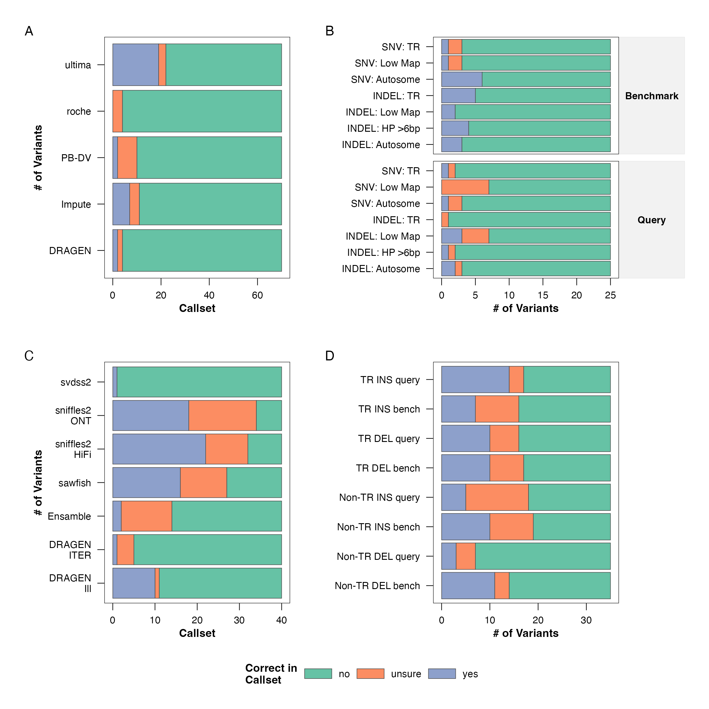{fig-alt="Evaluation grouped by callset"}
:::

::: {.g-col-6}
### Legacy `combined_eval`

{fig-alt="Legacy combined evaluation export"}
:::

::: {.g-col-6}
### Alternate `combined_callset_eval`

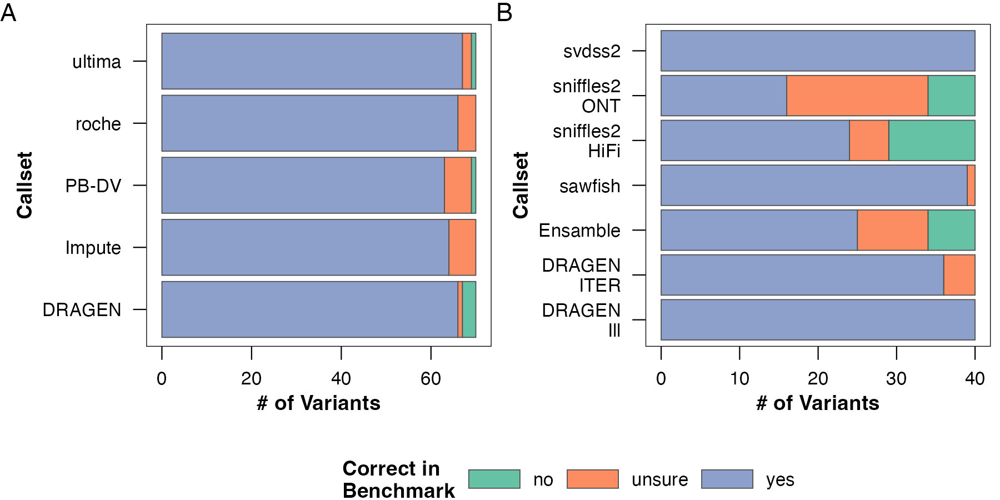{fig-alt="Alternate combined callset evaluation export"}
:::
:::

## Genome-wide ideogram alternatives

::: {.grid}
::: {.g-col-6}
### Detailed vertical layout

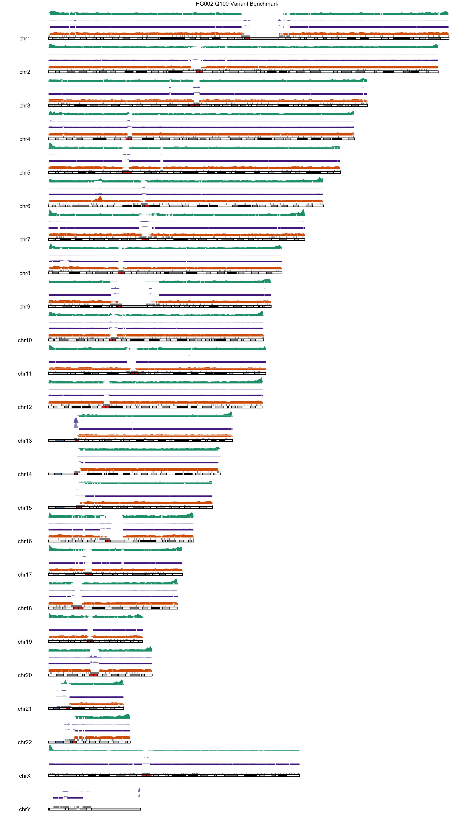{fig-alt="Detailed vertical genome ideogram"}
:::

::: {.g-col-6}
### KaryoScope painted chromosomes

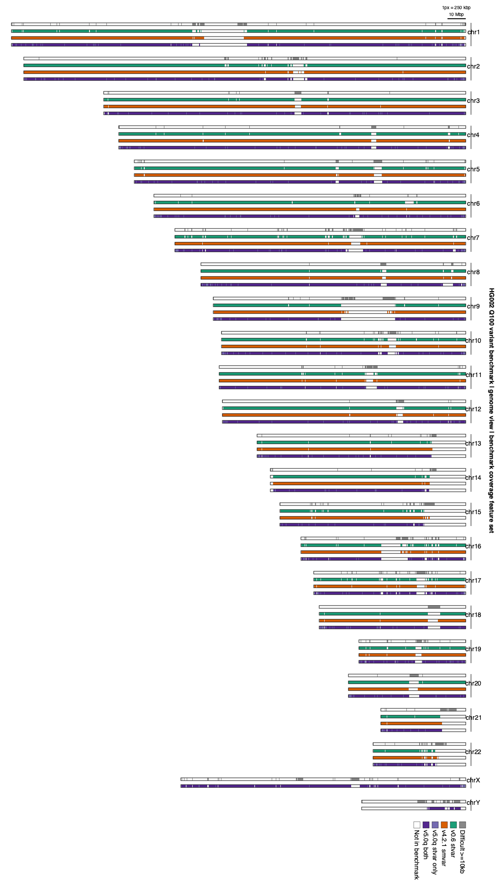{fig-alt="KaryoScope painted chromosome ideogram"}
:::

::: {.g-col-12}
### Compact horizontal strip

{fig-alt="Compact horizontal genome ideogram"}
:::
:::

## Chromosome 8 alternatives

The ideograms provide orientation; the synteny figure contains the alignment
evidence. They should not be treated as interchangeable without considering the
claim made in the manuscript text.

::: {.grid}
::: {.g-col-6}
### Composed synteny figure

{fig-alt="Chromosome 8 synteny figure"}
:::

::: {.g-col-6}
### Whole-chromosome ideogram

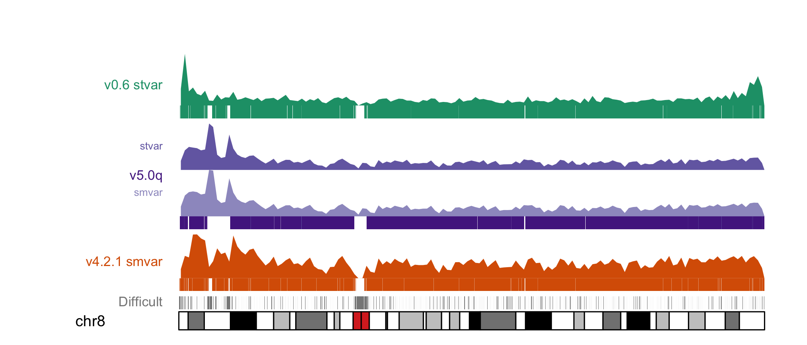{fig-alt="Whole chromosome 8 ideogram"}
:::

::: {.g-col-6}
### Zoomed ideogram

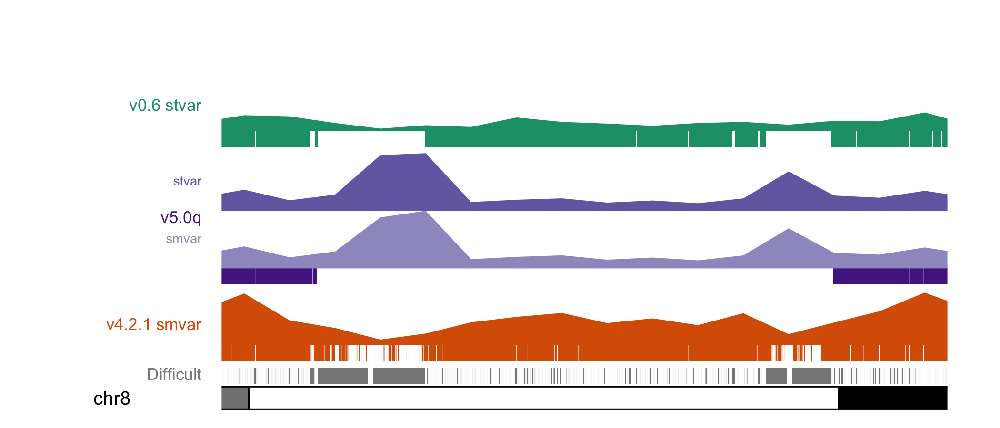{fig-alt="Zoomed chromosome 8 ideogram"}
:::
:::

## Use-case layouts

::: {.grid}
::: {.g-col-6}
### Current combined square layout

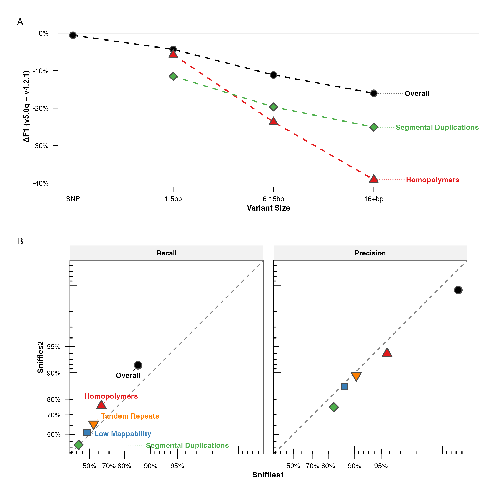{fig-alt="Combined small- and structural-variant use-case figure"}
:::

::: {.g-col-6}
### Alternate portrait layout

{fig-alt="Alternate portrait use-case figure"}
:::

::: {.g-col-4}
### Small variants

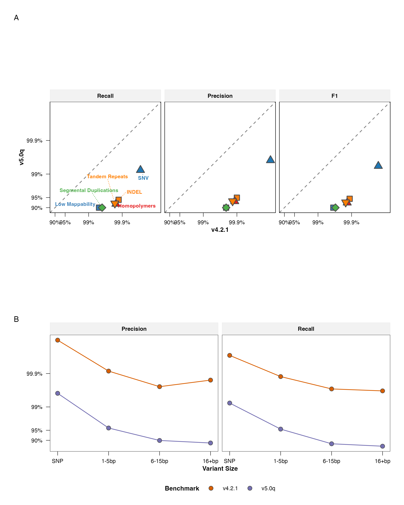{fig-alt="Small-variant use-case figure"}
:::

::: {.g-col-4}
### Structural variants — HiFi

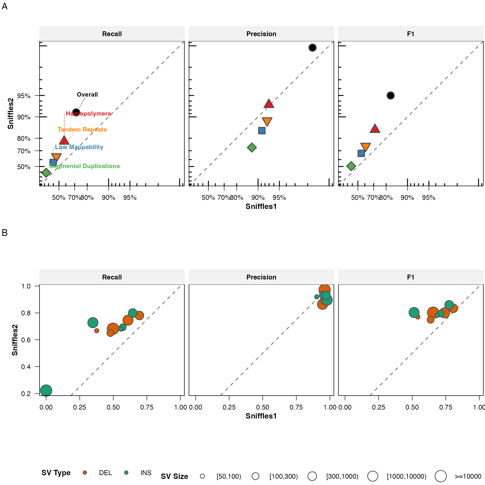{fig-alt="HiFi structural-variant use-case figure"}
:::

::: {.g-col-4}
### Structural variants — ONT

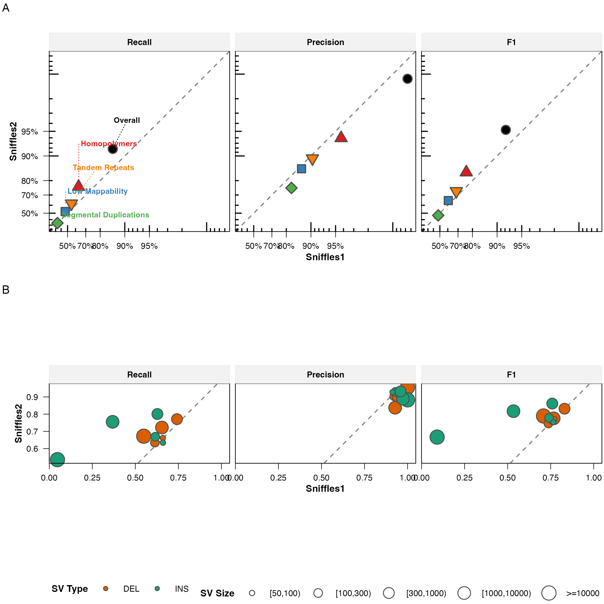{fig-alt="ONT structural-variant use-case figure"}
:::
:::

## Exclusion-method panels

These appear complementary rather than competing: one explains BED operations
and the other explains the exclusion categories. The likely decision is whether
to combine them as panels or move one/both to Methods or Supplementary Figures.

::: {.grid}
::: {.g-col-6}
### BED operations

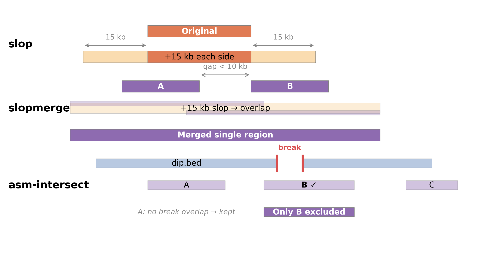{fig-alt="BED operations used for exclusions"}
:::

::: {.g-col-6}
### Exclusion categories

{fig-alt="Exclusion categories and benchmark construction"}
:::
:::

## Review checklist

For each selected figure, record:

- manuscript figure number and main/supplementary placement;
- exact canonical basename;
- source notebook or script;
- final physical width and height;
- required PNG and PDF/SVG exports;
- legend status and any unresolved annotations;
- confirmation that manuscript text and numeric values match the regenerated output.
