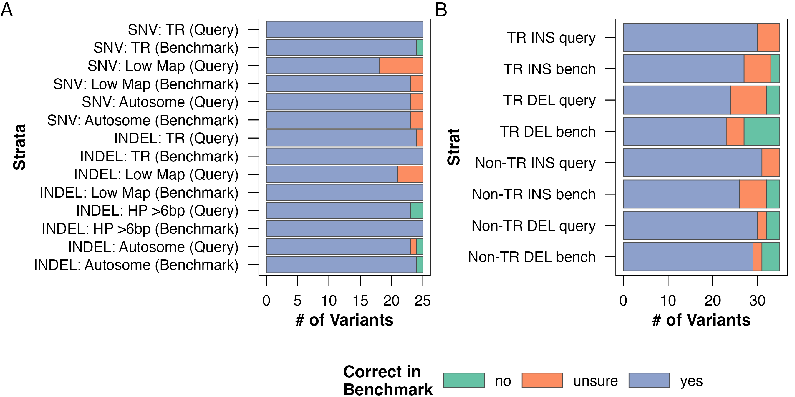
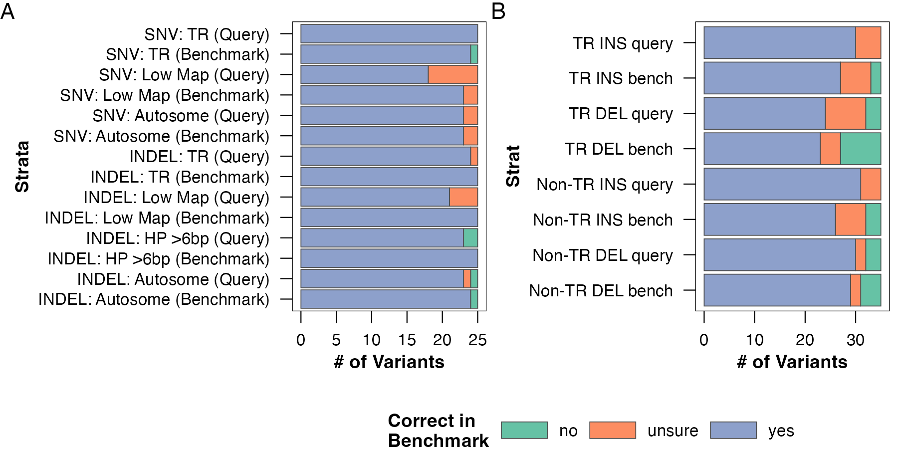
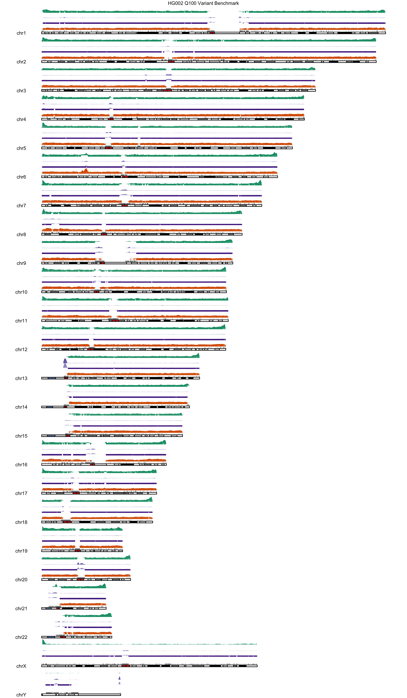
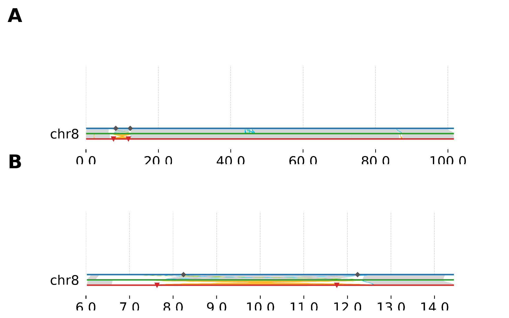
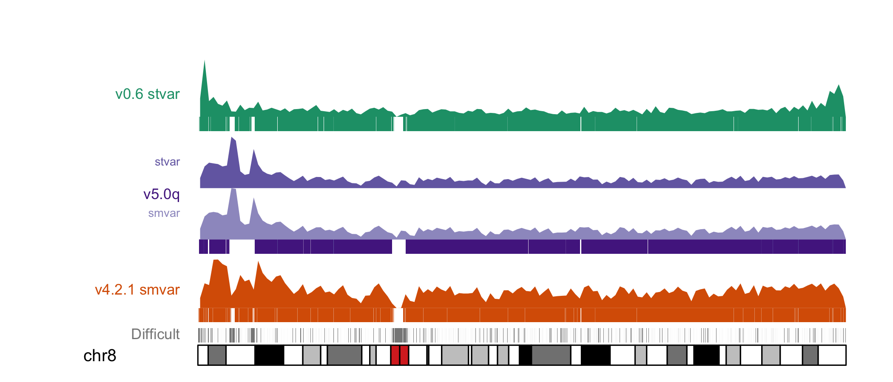
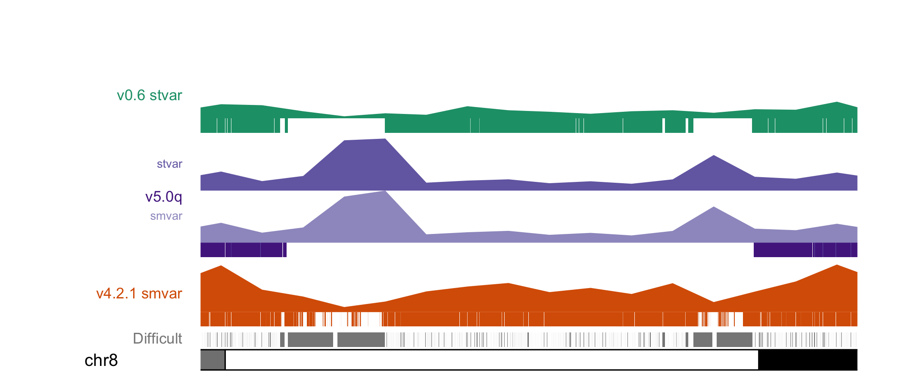
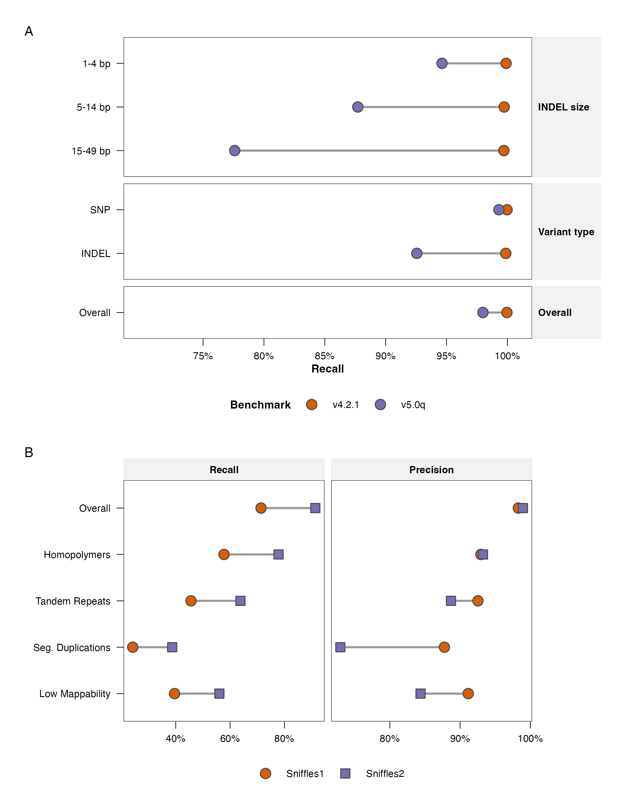
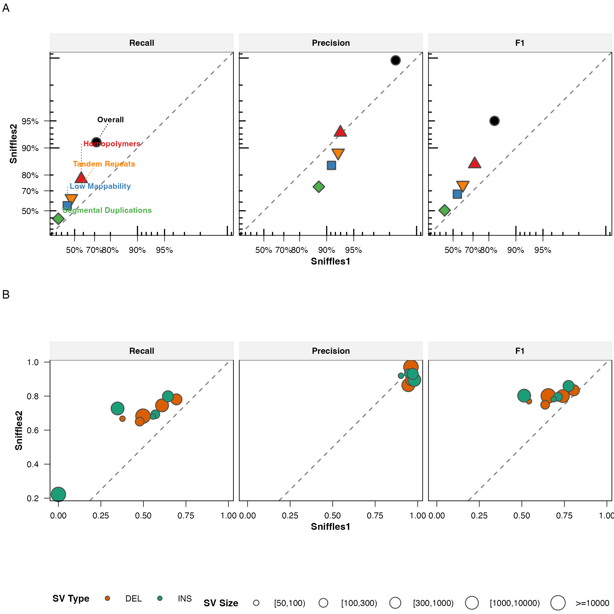
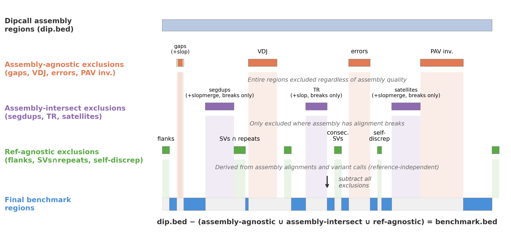

This dashboard records the figure review decisions. Selected figures still
require final manuscript numbering, legends, and print-size checks. Figures
marked for revision are not approved for publication in their current form.

## Decisions

| Figure family | Decision | Status / next action |
|---|---|---|
| External evaluation | Proceed with the recommended canonical stratified and callset figures | Selected: `combined_eval_strata` and `combined_eval_callset`; check manuscript references before retiring legacy exports |
| Ideogram | Use the detailed vertical layout | Selected: `ideogram_main`; verify labels at final manuscript width |
| Use case | Use the recommended combined figure | Selected: `use_case_combined`; retain the portrait `use_case` as an alternate layout |
| Chr8 | None of the current options is publication quality | Revise before selection; do not treat any displayed option as approved |
| Exclusions | Put BED operations in Supplemental Methods and exclusion categories in the main text | Placement selected; simplify the exclusion categories figure before publication |

## External evaluation layouts

These filenames currently overlap semantically. The two 2:1 panels appear to
represent different groupings; `combined_eval.png` and
`combined_callset_eval.png` may be legacy exports.

::: {.grid}
::: {.g-col-6}
### By strata — proposed canonical

{fig-alt="Evaluation grouped by benchmark strata"}
:::

::: {.g-col-6}
### By callset — proposed canonical

{fig-alt="Evaluation grouped by callset"}
:::

::: {.g-col-6}
### Legacy `combined_eval`

{fig-alt="Legacy combined evaluation export"}
:::

::: {.g-col-6}
### Alternate `combined_callset_eval`

{fig-alt="Alternate combined callset evaluation export"}
:::
:::

## Genome-wide ideogram alternatives

::: {.grid}
::: {.g-col-6}
### Detailed vertical layout

{fig-alt="Detailed vertical genome ideogram"}
:::

::: {.g-col-6}
### KaryoScope painted chromosomes

{fig-alt="KaryoScope painted chromosome ideogram"}
:::

::: {.g-col-12}
### Compact horizontal strip

{fig-alt="Compact horizontal genome ideogram"}
:::
:::

## Chromosome 8 alternatives

The ideograms provide orientation; the synteny figure contains the alignment
evidence. They should not be treated as interchangeable without considering the
claim made in the manuscript text. **Review outcome:** none of these options is
currently publication quality. The Chr8 figure requires revision before a
layout is selected.

::: {.grid}
::: {.g-col-6}
### Composed synteny figure

{fig-alt="Chromosome 8 synteny figure"}
:::

::: {.g-col-6}
### Whole-chromosome ideogram

{fig-alt="Whole chromosome 8 ideogram"}
:::

::: {.g-col-6}
### Zoomed ideogram

{fig-alt="Zoomed chromosome 8 ideogram"}
:::
:::

## Use-case layouts

::: {.grid}
::: {.g-col-6}
### Current combined square layout

{fig-alt="Combined small- and structural-variant use-case figure"}
:::

::: {.g-col-6}
### Alternate portrait layout

{fig-alt="Alternate portrait use-case figure"}
:::

::: {.g-col-4}
### Small variants

{fig-alt="Small-variant use-case figure"}
:::

::: {.g-col-4}
### Structural variants — HiFi

{fig-alt="HiFi structural-variant use-case figure"}
:::

::: {.g-col-4}
### Structural variants — ONT

{fig-alt="ONT structural-variant use-case figure"}
:::
:::

## Exclusion-method panels

These figures are complementary rather than competing. The BED-operations
figure will accompany Supplemental Methods. The exclusion-categories figure
will be a main-text figure, but its categories must be simplified before final
export.

::: {.grid}
::: {.g-col-6}
### BED operations

{fig-alt="BED operations used for exclusions"}
:::

::: {.g-col-6}
### Exclusion categories

{fig-alt="Exclusion categories and benchmark construction"}
:::
:::

## Review checklist

For each selected figure, record:

- manuscript figure number and main/supplementary placement;
- exact canonical basename;
- source notebook or script;
- final physical width and height;
- required PNG and PDF/SVG exports;
- legend status and any unresolved annotations;
- confirmation that manuscript text and numeric values match the regenerated output.
